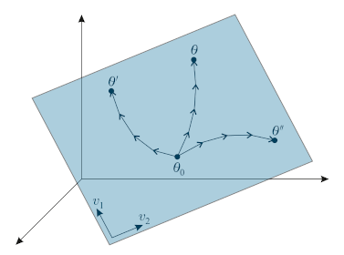

# Few-Shot Learning by Dimensionality Reduction in Gradient Space

Code to reproduce the experiments in the paper ["Few-Shot Learning by Dimensionality Reduction in Gradient Space"](#) (accepted to [CoLLAs 2022](http://lifelong-ml.cc/)).

**Blog post**: coming soon!




## Setup

1. Clone the repository
2. Install the conda environment: `conda env create -f environments/environment_{cpu,gpu}.yml`
3. Activate the environment: `conda activate fs`

## Experiments from the paper

The folder `experiments/` contains the configuration files and notebooks to run the sinusoid, RLC, and hydrology experiments from the paper.
Each experimental section contains notebooks that walk through the experiments.

## Experiments beyond the paper

This code base can be used for few-shot and supervised learning experiments in various ways. The following instructions give some details on the capabilities of the library.

### Running experiments

1. Create a run configuration file `config.yml`, e.g., based on the configuration from `example-config.yml` or one of the config files in the `experiments/` folders.
2. Train the model with `python tsfewshot/run.py train --config-file config.yml`. This creates a folder `runs/dev_run_yymmdd_hhmmss`, where the trained model will be stored.
   Optionally, you can specify `--gpu N` where N is the id of the GPU to be used. Negative values will use CPU.
3. Test the model with `python tsfewshot/run.py eval --run-dir runs/dev_run_yymmdd_hhmmss`.
   Optionally, you can specify the gpu with `--gpu`, the split (train/val/test) with `--split`, and the epoch with `--epoch` (-1 means the epoch that had the best validation metric).

### Running multiple experiments at once
Use `python tsfewshot/run_scheduler.py {train/eval/finetune} --directory dirname --gpu-ids 0 1 2 --runs-per-gpu 3` to train/evaluate/finetune on all configurations/directories inside of `dirname`. This will start 3 up to parallel runs on each specified GPU (0, 1, and 2).
Optionally, you can filter configuration files/directories with `--name-filter`.

### Supervised finetuning on a full dataset
To finetune a pretrained model on a full dataset (not just a support set), use `python tsfewshot/run.py finetune --config-file finetuneconfig.yml` (again, optionally with `--gpu`).
The provided config must have entries `base_run_dir` (path to the pretraining run) and `checkpoint_path` (path to the initial model).
All other config values provided in the finetuning config will overwrite values from the pretraining config.

_Note_: For technical reasons, this will finetune on the validation set and evaluate on the test set in the run configuration. I.e., you might want to overwrite `val_datasets` and `test_datasets` in the finetuning config.

## Citation

This paper has been accepted to the Conference on Lifelong Learning Agents (CoLLAs) 2022. While the conference proceedings do not yet exist, we recommend the following citation:

```bib
@article{gauch2022subgd,
  title={Caravan - A global community dataset for large-sample hydrology},
  author={Gauch, Martin and Beck, Maximilian and Adler, Thomas and Kotsur, Dmytro and Fiel, Stefan and 
          Eghbal-zadeh, Hamid and Brandstetter, Johannes and Kofler, Johannes and Holzleitner, Markus and 
          Zellinger, and Klotz, Daniel and Hochreiter, Sepp and Lehner, Sebastian},
  journal={arXiv preprint, accepted to Conference on Lifelong Learning Agents 2022}
  year={2022},
}
```

## Documentation
To run the documentation locally:

1. `cd docs`
2. `make html`
3. `python -m http.server --directory _build/html`
4. access http://localhost:8000

To create the apidocs from scratch: `sphinx-apidoc -o docs/api/ tsfewshot`
